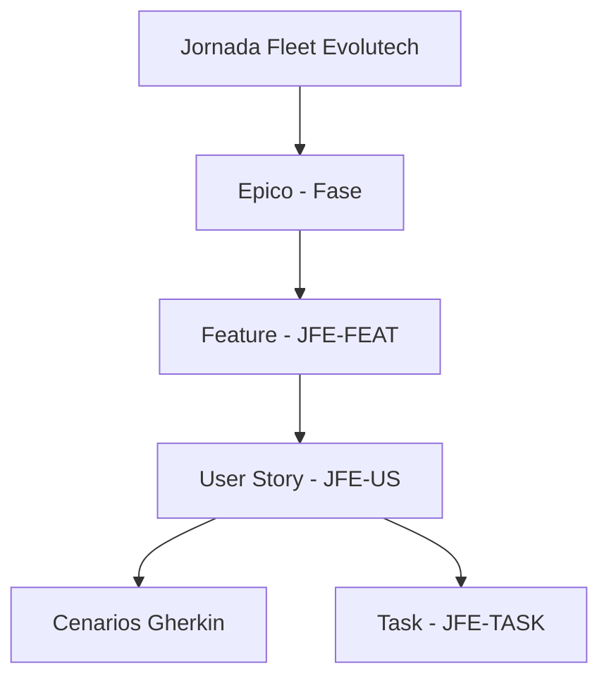
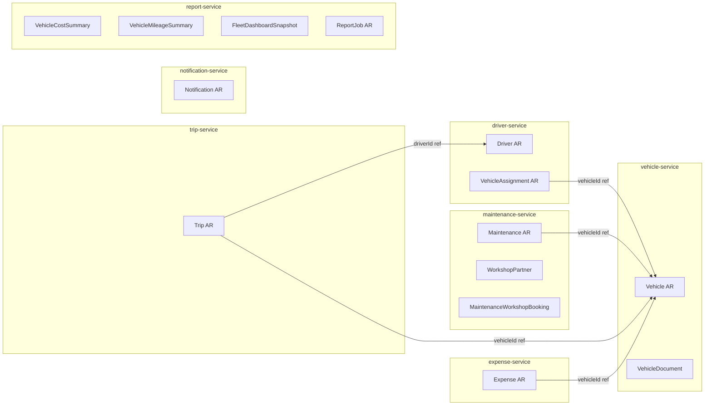
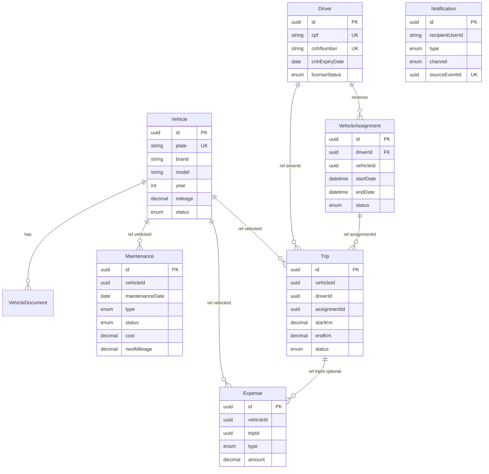
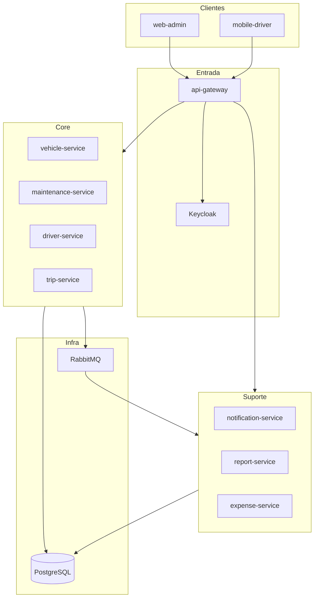

# Jornada Fleet Evolutech

Plataforma de gestão de frota veicular da Evolutech — do MVP monolítico à arquitetura de microserviços com painel web, app mobile e mensageria assíncrona.

---

## 1. Metodologia e Padrões

### 1.1 Hierarquia do Backlog




| Nível          | ID           | Propósito                                 | Princípio                                      |
| -------------- | ------------ | ----------------------------------------- | ---------------------------------------------- |
| **Épico**      | JFE-EPIC-XX  | Agrupa Features por fase/valor de negócio | SAFe / Scrum Epic                              |
| **Feature**    | JFE-FEAT-XXX | Entrega de valor mensurável ao usuário    | Feature-driven development                     |
| **User Story** | JFE-US-XXX   | Necessidade de um persona específico      | INVEST + 3C (Card, Conversation, Confirmation) |
| **Cenário**    | JFE-SC-XXX   | Critérios de aceite testáveis             | BDD / Gherkin (Given-When-Then)                |
| **Task**       | JFE-TASK-XXX | Trabalho técnico implementável            | Single responsibility, estimável               |


### 1.2 Personas da Jornada


| Persona              | Papel                                                  | Canal           |
| -------------------- | ------------------------------------------------------ | --------------- |
| **Gestor de Frota**  | Administra veículos, manutenções, motoristas e viagens | Web Admin       |
| **Motorista**        | Opera veículo, registra viagens                        | App Mobile      |
| **Administrador TI** | Configura infra, auth, observabilidade                 | CLI / DevOps    |
| **Desenvolvedor**    | Mantém serviços, contratos e qualidade                 | IDE / CI        |
| **Consumidor API**   | Integra sistemas externos                              | REST / Webhooks |


### 1.3 Priorização MoSCoW

- **Must Have (M)** — Bloqueia go-live da fase
- **Should Have (S)** — Alto valor, entregável na fase
- **Could Have (C)** — Desejável, stretch goal
- **Won't Have (W)** — Fora de escopo da fase

### 1.4 Definition of Ready (DoR) — User Story

- [ ] Persona, ação e benefício definidos
- [ ] Cenários Gherkin com caminho feliz + edge cases
- [ ] Dependências identificadas
- [ ] Critérios INVEST validados
- [ ] Story Points estimados

### 1.5 Definition of Done (DoD) — User Story

- [ ] Código implementado e revisado (PR aprovado)
- [ ] Testes unitários e integração passando
- [ ] Contrato OpenAPI/AsyncAPI atualizado (se aplicável)
- [ ] Cenários Gherkin automatizados ou validados manualmente
- [ ] Documentação mínima (README/ADR se arquitetural)
- [ ] Deployável em ambiente local via Docker Compose

---

## 2. Modelo de Domínio — Entidades da Jornada Fleet Evolutech

### 2.1 Princípios de Modelagem

| Princípio | Regra |
|-----------|-------|
| **Bounded Context** | Cada microserviço possui seu próprio modelo; sem FK entre bancos |
| **Aggregate Root** | Toda persistência passa pela raiz do agregado |
| **Identificador** | UUID (`String`, formato uuid) em todas as entidades de negócio |
| **Auditoria** | `createdAt` e `updatedAt` em toda entidade mutável |
| **Referência cross-service** | Apenas `UUID` do recurso externo (ex.: `vehicleId`), nunca `@ManyToOne` cross-DB |
| **Value Object** | Objetos imutáveis sem identidade própria (CPF, Placa, Money) |
| **Infraestrutura** | Outbox e ProcessedEvent não são entidades de negócio expostas na API |

### 2.2 Mapa de Contextos Delimitados



**Legenda:** AR = Aggregate Root

### 2.3 Catálogo de Entidades por Serviço

---

#### vehicle-service — Banco: `fleet_vehicle_db`

##### ENT-V01 — Vehicle (Aggregate Root) — Fase 1

| Campo | Tipo | Obrigatório | Regras |
|-------|------|-------------|--------|
| id | UUID | sim | PK, gerado |
| plate | String(10) | sim | Único, formato placa BR (Mercosul ou antigo) |
| brand | String(50) | sim | — |
| model | String(50) | sim | — |
| year | Integer | sim | 1900 ≤ year ≤ ano atual + 1 |
| color | String(30) | não | — |
| mileage | Decimal(10,2) | sim | ≥ 0; atualizado via evento `trip.completed` |
| status | VehicleStatus | sim | Default: ACTIVE |
| chassisNumber | String(17) | não | Único quando informado (VIN) |
| fuelType | FuelType | não | Default: FLEX |
| createdAt | DateTime | sim | Auditoria |
| updatedAt | DateTime | sim | Auditoria |

**Tabela:** `fleet_vehicle` · **Índices:** `uk_plate`, `idx_status`, `uk_chassis_number`

**Invariantes:**
- Placa única na frota
- Veículo INACTIVE não pode receber novas viagens (validado via API/evento)
- `mileage` nunca diminui (exceto correção manual por ADMIN)

---

##### ENT-V02 — VehicleDocument (Entity) — Fase 2

| Campo | Tipo | Obrigatório | Regras |
|-------|------|-------------|--------|
| id | UUID | sim | PK |
| vehicleId | UUID | sim | FK interna → Vehicle |
| documentType | VehicleDocumentType | sim | CRLV, INSURANCE, IPVA |
| documentNumber | String(50) | não | — |
| expiryDate | Date | sim | — |
| fileUrl | String(500) | não | URL do documento digitalizado |
| createdAt | DateTime | sim | — |
| updatedAt | DateTime | sim | — |

**Tabela:** `fleet_vehicle_document` · Pertence ao agregado Vehicle

---

#### maintenance-service — Banco: `fleet_maintenance_db`

##### ENT-M01 — Maintenance (Aggregate Root) — Fase 1

Evolução de `ManutentionEntity` do MVP; renomear para `Maintenance`.

| Campo | Tipo | Obrigatório | Regras |
|-------|------|-------------|--------|
| id | UUID | sim | PK |
| vehicleId | UUID | sim | Ref externa → vehicle-service |
| maintenanceDate | Date | sim | — |
| description | String(500) | sim | — |
| type | MaintenanceType | sim | PREVENTIVE, CORRECTIVE, INSPECTION |
| status | MaintenanceStatus | sim | Default: PENDING |
| cost | Decimal(12,2) | sim | ≥ 0 |
| mileageAtService | Decimal(10,2) | não | Km no momento do serviço |
| nextMileage | Decimal(10,2) | não | Km previsto para próxima manutenção |
| nextMaintenanceDate | Date | não | Data prevista alternativa |
| completedAt | DateTime | não | Preenchido ao concluir |
| createdAt | DateTime | sim | — |
| updatedAt | DateTime | sim | — |

**Tabela:** `fleet_maintenance` · **Índices:** `idx_vehicle_id`, `idx_status`, `idx_next_mileage`

**Invariantes:**
- `vehicleId` deve existir no vehicle-service (validação síncrona na criação)
- Transição de status: PENDING → IN_PROGRESS → COMPLETED | OVERDUE | CANCELLED
- OVERDUE setado apenas pelo job de verificação de km/data

---

##### ENT-M02 — WorkshopPartner (Entity) — Fase 2

| Campo | Tipo | Obrigatório | Regras |
|-------|------|-------------|--------|
| id | UUID | sim | PK |
| name | String(100) | sim | — |
| cnpj | String(14) | sim | Único |
| apiBaseUrl | String(500) | sim | URL da API parceira |
| apiKeySecretRef | String(100) | sim | Referência ao secret (não armazenar chave em claro) |
| active | Boolean | sim | Default: true |
| createdAt | DateTime | sim | — |
| updatedAt | DateTime | sim | — |

**Tabela:** `fleet_workshop_partner`

---

##### ENT-M03 — MaintenanceWorkshopBooking (Entity) — Fase 2

| Campo | Tipo | Obrigatório | Regras |
|-------|------|-------------|--------|
| id | UUID | sim | PK |
| maintenanceId | UUID | sim | FK interna → Maintenance |
| workshopId | UUID | sim | FK interna → WorkshopPartner |
| externalBookingId | String(100) | não | ID retornado pela oficina |
| scheduledDate | DateTime | sim | — |
| status | BookingStatus | sim | PENDING, CONFIRMED, CANCELLED, FAILED |
| createdAt | DateTime | sim | — |
| updatedAt | DateTime | sim | — |

**Tabela:** `fleet_maintenance_workshop_booking` · Pertence ao agregado Maintenance

---

#### driver-service — Banco: `fleet_driver_db`

##### ENT-D01 — Driver (Aggregate Root) — Fase 1

| Campo | Tipo | Obrigatório | Regras |
|-------|------|-------------|--------|
| id | UUID | sim | PK |
| keycloakUserId | String(36) | não | Vínculo com usuário Keycloak (obrigatório para motoristas com app) |
| fullName | String(150) | sim | — |
| cpf | String(11) | sim | Único, dígitos only |
| cnhNumber | String(11) | sim | Único |
| cnhCategory | String(5) | sim | A, B, C, D, E ou combinações |
| cnhExpiryDate | Date | sim | — |
| licenseStatus | DriverLicenseStatus | sim | Calculado: ACTIVE, EXPIRED, SUSPENDED |
| phone | String(20) | não | — |
| email | String(150) | não | — |
| active | Boolean | sim | Default: true |
| createdAt | DateTime | sim | — |
| updatedAt | DateTime | sim | — |

**Tabela:** `fleet_driver` · **Índices:** `uk_cpf`, `uk_cnh_number`, `idx_license_status`

**Invariantes:**
- CPF e CNH únicos
- Motorista SUSPENDED ou EXPIRED não pode receber assignment
- `licenseStatus` recalculado por job diário com base em `cnhExpiryDate`

---

##### ENT-D02 — VehicleAssignment (Aggregate Root) — Fase 1

| Campo | Tipo | Obrigatório | Regras |
|-------|------|-------------|--------|
| id | UUID | sim | PK |
| driverId | UUID | sim | FK interna → Driver |
| vehicleId | UUID | sim | Ref externa → vehicle-service |
| startDate | DateTime | sim | — |
| endDate | DateTime | não | Null = assignment ativo |
| status | AssignmentStatus | sim | ACTIVE, ENDED, CANCELLED |
| assignedByUserId | String(36) | sim | Keycloak sub do gestor |
| notes | String(500) | não | — |
| createdAt | DateTime | sim | — |
| updatedAt | DateTime | sim | — |

**Tabela:** `fleet_vehicle_assignment` · **Índices:** `idx_driver_id`, `idx_vehicle_id`, `idx_status`

**Invariantes:**
- Apenas 1 assignment ACTIVE por `vehicleId` simultaneamente
- Apenas 1 assignment ACTIVE por `driverId` simultaneamente
- Encerrar assignment preenche `endDate` e muda status para ENDED

---

#### trip-service — Banco: `fleet_trip_db`

##### ENT-T01 — Trip (Aggregate Root) — Fase 1

| Campo | Tipo | Obrigatório | Regras |
|-------|------|-------------|--------|
| id | UUID | sim | PK |
| vehicleId | UUID | sim | Ref → vehicle-service |
| driverId | UUID | sim | Ref → driver-service |
| assignmentId | UUID | sim | Ref → driver-service (assignment ativo na criação) |
| origin | String(200) | sim | — |
| destination | String(200) | não | Obrigatório ao completar |
| startKm | Decimal(10,2) | sim | ≥ mileage atual do veículo |
| endKm | Decimal(10,2) | não | Obrigatório ao completar; > startKm |
| distanceKm | Decimal(10,2) | não | Calculado: endKm - startKm |
| status | TripStatus | sim | IN_PROGRESS, COMPLETED, CANCELLED |
| startedAt | DateTime | sim | — |
| completedAt | DateTime | não | Preenchido ao completar |
| notes | String(500) | não | — |
| createdAt | DateTime | sim | — |
| updatedAt | DateTime | sim | — |

**Tabela:** `fleet_trip` · **Índices:** `idx_vehicle_id`, `idx_driver_id`, `idx_status`, `idx_started_at`

**Invariantes:**
- Apenas 1 trip IN_PROGRESS por veículo
- Apenas 1 trip IN_PROGRESS por motorista
- `endKm` > `startKm` ao completar
- DRIVER só opera trips onde `driverId` = seu próprio id

---

#### expense-service — Banco: `fleet_expense_db`

##### ENT-E01 — Expense (Aggregate Root) — Fase 2

Evolução do enum `typeCost` do MVP.

| Campo | Tipo | Obrigatório | Regras |
|-------|------|-------------|--------|
| id | UUID | sim | PK |
| vehicleId | UUID | sim | Ref → vehicle-service |
| tripId | UUID | não | Ref → trip-service |
| driverId | UUID | não | Ref → driver-service |
| type | ExpenseType | sim | FUEL, TOLL, PARKING, MAINTENANCE, OTHER |
| amount | Decimal(12,2) | sim | > 0 |
| expenseDate | Date | sim | — |
| description | String(500) | não | — |
| receiptUrl | String(500) | não | Comprovante digitalizado |
| createdByUserId | String(36) | sim | Keycloak sub |
| createdAt | DateTime | sim | — |
| updatedAt | DateTime | sim | — |

**Tabela:** `fleet_expense` · **Índices:** `idx_vehicle_id`, `idx_type`, `idx_expense_date`

---

#### notification-service — Banco: `fleet_notification_db`

##### ENT-N01 — Notification (Aggregate Root) — Fase 1

| Campo | Tipo | Obrigatório | Regras |
|-------|------|-------------|--------|
| id | UUID | sim | PK |
| recipientUserId | String(36) | sim | Keycloak sub |
| recipientDriverId | UUID | não | Para notificações específicas de motorista |
| type | NotificationType | sim | Ver enum abaixo |
| title | String(200) | sim | — |
| message | String(1000) | sim | — |
| payload | JSONB | não | Dados extras (vehicleId, maintenanceId, etc.) |
| channel | NotificationChannel | sim | IN_APP, EMAIL, PUSH |
| readAt | DateTime | não | Null = não lida |
| sourceEventId | UUID | sim | Idempotência com evento origem |
| sourceEventType | String(100) | sim | Ex.: maintenance.overdue |
| createdAt | DateTime | sim | — |

**Tabela:** `fleet_notification` · **Índices:** `idx_recipient_user_id`, `idx_read_at`, `uk_source_event_recipient`

---

#### report-service — Banco: `fleet_report_db`

> Modelo **CQRS**: projeções de leitura alimentadas por eventos; não compartilham transação com serviços core.

##### ENT-R01 — VehicleCostSummary (Read Model / Projection) — Fase 2

| Campo | Tipo | Descrição |
|-------|------|-----------|
| id | UUID | PK |
| vehicleId | UUID | Ref lógica |
| periodYear | Integer | Ano |
| periodMonth | Integer | Mês (1-12) |
| totalCost | Decimal(14,2) | Soma geral |
| fuelCost | Decimal(14,2) | Combustível |
| maintenanceCost | Decimal(14,2) | Manutenção |
| tollCost | Decimal(14,2) | Pedágio |
| parkingCost | Decimal(14,2) | Estacionamento |
| otherCost | Decimal(14,2) | Outros |
| lastEventAt | DateTime | Último evento processado |
| updatedAt | DateTime | — |

**Tabela:** `fleet_report_vehicle_cost_summary` · **UK:** `(vehicleId, periodYear, periodMonth)`

---

##### ENT-R02 — VehicleMileageSummary (Read Model / Projection) — Fase 2

| Campo | Tipo | Descrição |
|-------|------|-----------|
| id | UUID | PK |
| vehicleId | UUID | — |
| periodYear | Integer | — |
| periodMonth | Integer | — |
| totalKm | Decimal(12,2) | Km rodado no período |
| tripCount | Integer | Quantidade de viagens |
| lastEventAt | DateTime | — |
| updatedAt | DateTime | — |

**Tabela:** `fleet_report_vehicle_mileage_summary` · **UK:** `(vehicleId, periodYear, periodMonth)`

---

##### ENT-R03 — FleetDashboardSnapshot (Read Model / Projection) — Fase 2

| Campo | Tipo | Descrição |
|-------|------|-----------|
| id | UUID | PK |
| snapshotDate | Date | Data do snapshot |
| activeVehicles | Integer | Veículos ACTIVE |
| inactiveVehicles | Integer | — |
| pendingMaintenances | Integer | — |
| overdueMaintenances | Integer | — |
| activeDrivers | Integer | — |
| tripsToday | Integer | — |
| totalKmToday | Decimal(12,2) | — |
| updatedAt | DateTime | — |

**Tabela:** `fleet_report_dashboard_snapshot` · **UK:** `snapshotDate`

---

##### ENT-R04 — ReportJob (Aggregate Root) — Fase 2

| Campo | Tipo | Obrigatório | Regras |
|-------|------|-------------|--------|
| id | UUID | sim | PK |
| requestedByUserId | String(36) | sim | Keycloak sub |
| reportType | ReportType | sim | COST, MILEAGE, TRIPS, MAINTENANCE, FULL |
| parameters | JSONB | sim | Filtros (vehicleId, from, to) |
| status | ReportJobStatus | sim | PENDING, PROCESSING, COMPLETED, FAILED |
| fileUrl | String(500) | não | URL do CSV/PDF gerado |
| errorMessage | String(500) | não | Se FAILED |
| createdAt | DateTime | sim | — |
| completedAt | DateTime | não | — |

**Tabela:** `fleet_report_job`

---

### 2.4 Entidades de Infraestrutura (por serviço publicador/consumidor)

Não expostas na API pública; suportam mensageria confiável.

##### ENT-I01 — OutboxEvent (Infrastructure) — Fase 1

Presente em: vehicle, maintenance, driver, trip, expense services.

| Campo | Tipo | Descrição |
|-------|------|-----------|
| id | UUID | PK |
| aggregateType | String(50) | Ex.: Vehicle, Maintenance |
| aggregateId | UUID | ID da entidade origem |
| eventType | String(100) | Ex.: vehicle.created |
| payload | JSONB | Corpo do evento |
| status | OutboxStatus | PENDING, PUBLISHED, FAILED |
| createdAt | DateTime | — |
| publishedAt | DateTime | — |
| retryCount | Integer | Default: 0 |

**Tabela:** `fleet_outbox_event` · **Índices:** `idx_status_created_at`

---

##### ENT-I02 — ProcessedEvent (Infrastructure) — Fase 1

Presente em: notification-service, report-service, vehicle-service (consumer).

| Campo | Tipo | Descrição |
|-------|------|-----------|
| eventId | UUID | PK — ID do evento recebido |
| eventType | String(100) | — |
| consumerService | String(50) | Nome do serviço consumidor |
| processedAt | DateTime | — |

**Tabela:** `fleet_processed_event` · Garante idempotência no consumo

---

### 2.5 Value Objects (fleet-common)

Objetos imutáveis, validados na camada de domínio, serializados como primitivos na persistência.

| Value Object | Campos | Validação | Usado em |
|--------------|--------|-----------|----------|
| **Plate** | value: String | Regex placa BR (Mercosul `[A-Z]{3}[0-9][A-Z0-9][0-9]{2}` ou antigo `[A-Z]{3}-?[0-9]{4}`) | Vehicle |
| **Cpf** | value: String(11) | Dígitos verificadores | Driver |
| **Cnh** | number: String, category: String, expiryDate: Date | Número 11 dígitos; category válida | Driver |
| **Money** | amount: BigDecimal, currency: String | amount ≥ 0; currency default BRL | Maintenance, Expense |
| **Mileage** | value: Decimal | value ≥ 0 | Vehicle, Trip, Maintenance |
| **Period** | year: Integer, month: Integer | month 1-12 | Report projections |

---

### 2.6 Enums do Domínio

| Enum | Valores | Serviço | Substitui no MVP |
|------|---------|---------|------------------|
| **VehicleStatus** | ACTIVE, IN_MAINTENANCE, INACTIVE | vehicle | — |
| **FuelType** | GASOLINE, ETHANOL, FLEX, DIESEL, ELECTRIC, HYBRID | vehicle | — |
| **VehicleDocumentType** | CRLV, INSURANCE, IPVA | vehicle | — |
| **MaintenanceType** | PREVENTIVE, CORRECTIVE, INSPECTION | maintenance | campo `type` String |
| **MaintenanceStatus** | PENDING, IN_PROGRESS, COMPLETED, OVERDUE, CANCELLED | maintenance | `ManutentionDoneStatus` + boolean `done` |
| **BookingStatus** | PENDING, CONFIRMED, CANCELLED, FAILED | maintenance | — |
| **DriverLicenseStatus** | ACTIVE, EXPIRED, SUSPENDED | driver | `DriverLicenseStatus` (remover INACTIVE) |
| **AssignmentStatus** | ACTIVE, ENDED, CANCELLED | driver | — |
| **TripStatus** | IN_PROGRESS, COMPLETED, CANCELLED | trip | — |
| **ExpenseType** | FUEL, TOLL, PARKING, MAINTENANCE, OTHER | expense | `typeCost` |
| **NotificationType** | MAINTENANCE_DUE, MAINTENANCE_OVERDUE, LICENSE_EXPIRING, LICENSE_EXPIRED, TRIP_COMPLETED, DRIVER_ASSIGNED, REPORT_READY, SYSTEM | notification | — |
| **NotificationChannel** | IN_APP, EMAIL, PUSH | notification | — |
| **ReportType** | COST, MILEAGE, TRIPS, MAINTENANCE, FULL | report | — |
| **ReportJobStatus** | PENDING, PROCESSING, COMPLETED, FAILED | report | — |
| **OutboxStatus** | PENDING, PUBLISHED, FAILED | infra | — |

---

### 2.7 Diagrama ER — Contexto Core (Fase 1)



> Relações tracejadas (`ref vehicleId`) são referências lógicas cross-service, **não FK física**.

---

### 2.8 Matriz Entidade × Feature × Fase

| ID | Entidade | Aggregate Root | Serviço | Feature | Fase |
|----|----------|----------------|---------|---------|------|
| ENT-V01 | Vehicle | sim | vehicle-service | JFE-FEAT-004 | 1 |
| ENT-V02 | VehicleDocument | não | vehicle-service | — | 2 |
| ENT-M01 | Maintenance | sim | maintenance-service | JFE-FEAT-005 | 1 |
| ENT-M02 | WorkshopPartner | não | maintenance-service | JFE-FEAT-013 | 2 |
| ENT-M03 | MaintenanceWorkshopBooking | não | maintenance-service | JFE-FEAT-013 | 2 |
| ENT-D01 | Driver | sim | driver-service | JFE-FEAT-006 | 1 |
| ENT-D02 | VehicleAssignment | sim | driver-service | JFE-FEAT-006 | 1 |
| ENT-T01 | Trip | sim | trip-service | JFE-FEAT-007 | 1 |
| ENT-E01 | Expense | sim | expense-service | JFE-FEAT-011 | 2 |
| ENT-N01 | Notification | sim | notification-service | JFE-FEAT-008 | 1 |
| ENT-R01 | VehicleCostSummary | projeção | report-service | JFE-FEAT-012 | 2 |
| ENT-R02 | VehicleMileageSummary | projeção | report-service | JFE-FEAT-012 | 2 |
| ENT-R03 | FleetDashboardSnapshot | projeção | report-service | JFE-FEAT-012 | 2 |
| ENT-R04 | ReportJob | sim | report-service | JFE-FEAT-012 | 2 |
| ENT-I01 | OutboxEvent | infra | todos publicadores | JFE-FEAT-003 | 1 |
| ENT-I02 | ProcessedEvent | infra | todos consumidores | JFE-FEAT-003 | 1 |

**Total:** 16 entidades (10 aggregate roots + 4 read models/projeções + 2 infra)

---

### 2.9 Entidades fora do domínio (gerenciadas externamente)

| Conceito | Onde vive | Relação com domínio |
|----------|-----------|---------------------|
| **User / Account** | Keycloak | Referenciado por `keycloakUserId` em Driver e campos `*UserId` |
| **Role / Permission** | Keycloak | ADMIN, FLEET_MANAGER, DRIVER — não persistido em serviços core |
| **Arquivo / Comprovante** | Object Storage (S3/MinIO) | Referenciado por `fileUrl` / `receiptUrl` |

---

### 2.10 Convenções de Nomenclatura

| Camada | Monolito MVP (atual) | Jornada Fleet Evolutech (alvo) |
|--------|----------------------|--------------------------------|
| Tabela | `TBG_VEHICLE`, `TBG_MANUTENTION` | `fleet_{entity}` snake_case |
| Entidade Java | `VehicleEntity`, `ManutentionEntity` | `Vehicle`, `Maintenance` (sem sufixo Entity) |
| Pacote | `model.entity` | `{service}.domain.model` |
| Enum | `typeCost`, `ManutentionDoneStatus` | `ExpenseType`, `MaintenanceStatus` (PascalCase) |
| ID | Long/String inconsistente | UUID String em todos os serviços |

---

## 3. Templates Oficiais

### Template — Feature

```yaml
ID: JFE-FEAT-XXX
Épico: JFE-EPIC-XX
Título: [Nome da Feature]
Objetivo de Negócio: [Por que existe]
Personas Impactadas: [Gestor | Motorista | Dev | Admin TI]
Prioridade: M | S | C | W
Serviço(s): [vehicle-service | ...]
Critérios de Conclusão da Feature:
  - [ ] Critério mensurável 1
  - [ ] Critério mensurável 2
Dependências: [JFE-FEAT-YYY]
Riscos: [opcional]
```

### Template — User Story

```yaml
ID: JFE-US-XXX
Feature: JFE-FEAT-XXX
Formato: Como [persona], eu quero [ação] para [benefício]
Prioridade: M | S | C
Story Points: [1|2|3|5|8|13]
INVEST:
  Independent: [sim/não + nota]
  Negotiable: [sim]
  Valuable: [valor explícito]
  Estimable: [sim]
  Small: [cabível em 1 sprint]
  Testable: [cenários abaixo]
```

### Template — Cenário (Gherkin)

```gherkin
# language: pt
Cenário: [nome descritivo]
  Dado que [contexto/precondição]
  E [precondição adicional]
  Quando [ação do usuário/sistema]
  Então [resultado esperado]
  E [resultado adicional]
```

### Template — Task

```yaml
ID: JFE-TASK-XXX
User Story: JFE-US-XXX
Tipo: Backend | Frontend | Infra | Test | Docs | Contract
Título: [ação técnica concreta]
Estimativa: XS(≤2h) | S(≤4h) | M(≤1d) | L(≤2d)
Dependências: [JFE-TASK-YYY]
DoD Técnico:
  - [ ] Implementado
  - [ ] Testado
  - [ ] Sem regressão
```

---

## 4. Mapa de Épicos


| Épico       | Nome                        | Fase | Features                    |
| ----------- | --------------------------- | ---- | --------------------------- |
| JFE-EPIC-00 | Fundação e Qualidade        | 0    | JFE-FEAT-001, JFE-FEAT-002  |
| JFE-EPIC-01 | Plataforma e Infraestrutura | 1    | JFE-FEAT-003                |
| JFE-EPIC-02 | Domínio Core da Frota       | 1    | JFE-FEAT-004, 005, 006, 007 |
| JFE-EPIC-03 | Experiência do Usuário      | 1    | JFE-FEAT-008, 009, 010      |
| JFE-EPIC-04 | Inteligência e Integrações  | 2    | JFE-FEAT-011, 012, 013      |


---

## 5. Backlog Detalhado — Jornada Fleet Evolutech

---

### JFE-EPIC-00 — Fundação e Qualidade

---

#### JFE-FEAT-001 — Estabilização do Monolito MVP

```yaml
Épico: JFE-EPIC-00
Título: Estabilização do Monolito MVP
Objetivo de Negócio: Garantir base confiável antes da extração em microserviços
Personas: Desenvolvedor, Consumidor API
Prioridade: M
Serviço(s): fleet (monolito atual)
Critérios de Conclusão:
  - [ ] Banco PostgreSQL alinhado e migrations Flyway ativas
  - [ ] IDs e entidades consistentes em todo o domínio
  - [ ] Cobertura de testes ≥ 70% nos services
  - [ ] Zero bugs críticos conhecidos (update, mapper, sort)
Dependências: nenhuma
```

##### JFE-US-001 — Ambiente de banco reproduzível

**Como** desenvolvedor, **eu quero** que o banco PostgreSQL esteja configurado de forma consistente **para** subir o projeto localmente sem erros de conexão ou schema.


| Atributo     | Valor                                   |
| ------------ | --------------------------------------- |
| Prioridade   | M                                       |
| Story Points | 3                                       |
| INVEST       | Independent ✓ · Valuable ✓ · Testable ✓ |


**JFE-SC-001 — Conexão PostgreSQL bem-sucedida**

```gherkin
Cenário: Aplicação conecta ao PostgreSQL via Docker Compose
  Dado que o Docker Compose está rodando com o serviço postgres
  E o application.properties aponta para jdbc:postgresql://localhost:5432/fleet_db
  Quando eu inicio a aplicação Spring Boot
  Então a aplicação sobe sem erro de conexão
  E as tabelas são criadas via Flyway migration V1
```

**JFE-SC-002 — Rejeição de configuração MySQL obsoleta**

```gherkin
Cenário: Configuração MySQL não é mais suportada
  Dado que o application.properties contém jdbc:mysql
  Quando eu inicio a aplicação
  Então a aplicação falha com mensagem clara de driver ausente
```


| Task         | Título                                                                         | Tipo    | Est. |
| ------------ | ------------------------------------------------------------------------------ | ------- | ---- |
| JFE-TASK-001 | Corrigir `application.properties` para PostgreSQL alinhado ao `compose.yaml`   | Infra   | S    |
| JFE-TASK-002 | Adicionar dependência Flyway e migration V1 (`TBG_VEHICLE`, `TBG_MAINTENANCE`) | Backend | M    |
| JFE-TASK-003 | Remover `ddl-auto=update` e documentar fluxo de migration no README            | Docs    | XS   |
| JFE-TASK-004 | Teste de integração com Testcontainers PostgreSQL                              | Test    | M    |


---

##### JFE-US-002 — Identificadores consistentes no domínio

**Como** desenvolvedor, **eu quero** IDs padronizados em todas as entidades **para** evitar erros de persistência e inconsistência na API.


| Atributo     | Valor |
| ------------ | ----- |
| Prioridade   | M     |
| Story Points | 5     |


**JFE-SC-003 — Criação de veículo com UUID**

```gherkin
Cenário: Veículo criado recebe UUID válido
  Dado que não existe veículo com placa "ABC1D23"
  Quando eu envio POST /api/v1/vehicles com placa "ABC1D23"
  Então recebo HTTP 201
  E o campo id é um UUID válido no formato string
  E o id retornado é persistido corretamente no banco
```

**JFE-SC-004 — Manutenção com ID consistente entre camadas**

```gherkin
Cenário: CRUD de manutenção usa mesmo tipo de ID em todas as camadas
  Dado que existe um veículo com id "550e8400-e29b-41d4-a716-446655440000"
  Quando eu crio uma manutenção vinculada a esse veículo
  Então o id da manutenção é UUID string
  E GET /api/v1/maintenances/{id} retorna o mesmo registro
  E o repositório JPA usa o tipo correto no generic ID
```


| Task         | Título                                                                | Tipo     | Est. |
| ------------ | --------------------------------------------------------------------- | -------- | ---- |
| JFE-TASK-005 | Padronizar ID como UUID (String) em VehicleEntity e ManutentionEntity | Backend  | M    |
| JFE-TASK-006 | Corrigir ManutentionRepository generic type                           | Backend  | S    |
| JFE-TASK-007 | Atualizar controllers/services para UUID (remover Long.parseLong)     | Backend  | M    |
| JFE-TASK-008 | Atualizar OpenAPI schemas (id: string, format: uuid)                  | Contract | S    |
| JFE-TASK-009 | Testes unitários de persistência com IDs UUID                         | Test     | S    |


---

##### JFE-US-003 — Tratamento de erros padronizado na API

**Como** consumidor da API, **eu quero** respostas HTTP semânticas e mensagens claras **para** integrar sem adivinhar o tipo de erro.


| Atributo     | Valor |
| ------------ | ----- |
| Prioridade   | M     |
| Story Points | 3     |


**JFE-SC-005 — Recurso não encontrado retorna 404**

```gherkin
Cenário: Veículo inexistente
  Dado que não existe veículo com id "00000000-0000-0000-0000-000000000000"
  Quando eu envio GET /api/v1/vehicles/00000000-0000-0000-0000-000000000000
  Então recebo HTTP 404
  E o corpo contém code "VEHICLE_NOT_FOUND" e message descritiva
```

**JFE-SC-006 — Placa duplicada retorna 409**

```gherkin
Cenário: Tentativa de cadastro com placa existente
  Dado que existe veículo com placa "ABC1D23"
  Quando eu envio POST /api/v1/vehicles com placa "ABC1D23"
  Então recebo HTTP 409
  E o corpo contém code "VEHICLE_PLATE_CONFLICT"
```

**JFE-SC-007 — Payload inválido retorna 400**

```gherkin
Cenário: Campos obrigatórios ausentes
  Dado que envio POST /api/v1/vehicles sem o campo plate
  Quando a requisição é processada
  Então recebo HTTP 400
  E o corpo lista os campos inválidos
```


| Task         | Título                                                                       | Tipo    | Est. |
| ------------ | ---------------------------------------------------------------------------- | ------- | ---- |
| JFE-TASK-010 | Implementar `@ControllerAdvice` global                                       | Backend | M    |
| JFE-TASK-011 | Criar `ErrorResponse` padronizado (code, message, timestamp, path)           | Backend | S    |
| JFE-TASK-012 | Mapear BusinessException → 409, NotFoundException → 404                      | Backend | S    |
| JFE-TASK-013 | Adicionar `@Valid` nos controllers e handler MethodArgumentNotValidException | Backend | S    |
| JFE-TASK-014 | Testes MockMvc para cenários 400/404/409                                     | Test    | M    |


---

##### JFE-US-004 — Correção de bugs críticos do MVP

**Como** gestor de frota, **eu quero** que atualizações de veículos funcionem corretamente **para** manter dados precisos no inventário.


| Atributo     | Valor |
| ------------ | ----- |
| Prioridade   | M     |
| Story Points | 3     |


**JFE-SC-008 — Update de veículo usa ID do path**

```gherkin
Cenário: Atualização parcial de veículo existente
  Dado que existe veículo id "V1" com placa "ABC1D23" e cor "Preto"
  Quando eu envio PUT /api/v1/vehicles/V1 com cor "Branco"
  Então recebo HTTP 200
  E o veículo V1 tem cor "Branco"
  E nenhum veículo duplicado foi criado
```

**JFE-SC-009 — Auditoria de datas preenchida**

```gherkin
Cenário: Campos createdAt e updatedAt populados automaticamente
  Dado que @EnableJpaAuditing está habilitado
  Quando eu crio um veículo
  Então createdAt e updatedAt são preenchidos
  E updatedAt é atualizado após um PUT
```

**JFE-SC-010 — Listagem de veículos sem erro de sort**

```gherkin
Cenário: Listagem ordenada por placa
  Dado que existem veículos cadastrados
  Quando eu envio GET /api/v1/vehicles
  Então recebo HTTP 200 com lista ordenada por plate ASC
  E nenhum erro 500 é retornado
```


| Task         | Título                                               | Tipo    | Est. |
| ------------ | ---------------------------------------------------- | ------- | ---- |
| JFE-TASK-015 | Corrigir PUT vehicle: propagar id do path ao service | Backend | S    |
| JFE-TASK-016 | Adicionar `@EnableJpaAuditing` em FleetApplication   | Backend | XS   |
| JFE-TASK-017 | Corrigir sort em VehicleServiceImpl (plate ASC)      | Backend | XS   |
| JFE-TASK-018 | Corrigir ManutentionMapper (builder, vehicleEntity)  | Backend | M    |
| JFE-TASK-019 | Testes de regressão para os 3 bugs                   | Test    | S    |


---

#### JFE-FEAT-002 — Contratos e Documentação da API

```yaml
Épico: JFE-EPIC-00
Título: Contratos e Documentação da API
Objetivo de Negócio: API previsível e documentada para integradores e frontends
Personas: Consumidor API, Desenvolvedor
Prioridade: M
Dependências: JFE-FEAT-001
Critérios de Conclusão:
  - [ ] OpenAPI alinhado 100% com implementação
  - [ ] Swagger UI acessível em /swagger-ui
  - [ ] README com setup completo
```

##### JFE-US-005 — Versionamento consistente da API

**Como** consumidor da API, **eu quero** endpoints versionados em `/api/v1` **para** evoluir contratos sem quebrar integrações existentes.

**JFE-SC-011 — Endpoints sob /api/v1**

```gherkin
Cenário: Todos os endpoints usam prefixo v1
  Dado que a aplicação está rodando
  Quando eu acesso GET /api/v1/vehicles
  Então recebo HTTP 200
  Quando eu acesso GET /api/vehicles
  Então recebo HTTP 404
```


| Task         | Título                                             | Tipo     | Est. |
| ------------ | -------------------------------------------------- | -------- | ---- |
| JFE-TASK-020 | Configurar context-path ou prefix `/api/v1`        | Backend  | S    |
| JFE-TASK-021 | Atualizar evolutech-fleet.yaml servers URL         | Contract | XS   |
| JFE-TASK-022 | Regenerar interfaces OpenAPI e ajustar controllers | Backend  | S    |


---

##### JFE-US-006 — Documentação interativa da API

**Como** desenvolvedor integrador, **eu quero** Swagger UI **para** explorar e testar endpoints sem Postman.

**JFE-SC-012 — Swagger UI disponível**

```gherkin
Cenário: Acesso à documentação interativa
  Dado que a aplicação está rodando
  Quando eu acesso /swagger-ui/index.html
  Então vejo todos os endpoints de Vehicle e Maintenance
  E consigo executar uma requisição de exemplo
```


| Task         | Título                                                      | Tipo     | Est. |
| ------------ | ----------------------------------------------------------- | -------- | ---- |
| JFE-TASK-023 | Adicionar springdoc-openapi-starter-webmvc-ui               | Backend  | S    |
| JFE-TASK-024 | Sincronizar schema Maintenance (type, mileage, nextMileage) | Contract | S    |
| JFE-TASK-025 | Criar README.md (setup, run, arquitetura, endpoints)        | Docs     | M    |


---

### JFE-EPIC-01 — Plataforma e Infraestrutura

---

#### JFE-FEAT-003 — Infraestrutura Base da Plataforma

```yaml
Épico: JFE-EPIC-01
Título: Infraestrutura Base da Plataforma
Objetivo de Negócio: Ambiente local e padrões compartilhados para todos os microserviços
Personas: Administrador TI, Desenvolvedor
Prioridade: M
Serviço(s): api-gateway, fleet-common, Keycloak
Dependências: JFE-FEAT-002
Critérios de Conclusão:
  - [ ] docker-compose sobe todos os serviços de infra
  - [ ] Gateway roteia para microserviços
  - [ ] Auth OAuth2 funcional com 3 roles
  - [ ] RabbitMQ recebe e entrega eventos de teste
```

##### JFE-US-007 — Ambiente local integrado via Docker Compose

**Como** desenvolvedor, **eu quero** subir toda a infraestrutura com um comando **para** desenvolver microserviços de forma integrada.

**JFE-SC-013 — Stack completa sobe com docker compose up**

```gherkin
Cenário: Infraestrutura local disponível
  Dado que estou na raiz do monorepo fleet
  Quando eu executo docker compose up -d
  Então PostgreSQL, RabbitMQ, Redis e Keycloak ficam healthy
  E consigo acessar RabbitMQ Management em localhost:15672
  E consigo acessar Keycloak Admin em localhost:8081
```


| Task         | Título                                                                       | Tipo  | Est. |
| ------------ | ---------------------------------------------------------------------------- | ----- | ---- |
| JFE-TASK-026 | Criar docker-compose.yml raiz (Postgres multi-db, RabbitMQ, Redis, Keycloak) | Infra | L    |
| JFE-TASK-027 | Scripts init-db para criar fleet_vehicle_db, fleet_maintenance_db, etc.      | Infra | M    |
| JFE-TASK-028 | Configurar realm Keycloak "fleet" com clients web-admin e mobile-driver      | Infra | M    |
| JFE-TASK-029 | Definir roles ADMIN, FLEET_MANAGER, DRIVER no Keycloak                       | Infra | S    |


---

##### JFE-US-008 — API Gateway como ponto único de entrada

**Como** administrador TI, **eu quero** um API Gateway centralizado **para** controlar roteamento, auth e rate limiting.

**JFE-SC-014 — Roteamento para vehicle-service**

```gherkin
Cenário: Requisição roteada via Gateway
  Dado que vehicle-service está rodando na porta 8081
  E o Gateway está na porta 8080
  Quando eu envio GET http://localhost:8080/api/v1/vehicles com JWT válido
  Então o Gateway encaminha para vehicle-service
  E recebo HTTP 200 com lista de veículos
```

**JFE-SC-015 — Requisição sem token rejeitada**

```gherkin
Cenário: Acesso não autenticado bloqueado
  Dado que o Gateway exige autenticação
  Quando eu envio GET /api/v1/vehicles sem Authorization header
  Então recebo HTTP 401 Unauthorized
```


| Task         | Título                                                   | Tipo    | Est. |
| ------------ | -------------------------------------------------------- | ------- | ---- |
| JFE-TASK-030 | Scaffold api-gateway com Spring Cloud Gateway            | Backend | M    |
| JFE-TASK-031 | Configurar rotas /api/v1/vehicles/** → vehicle-service   | Infra   | S    |
| JFE-TASK-032 | Integrar OAuth2 Resource Server (JWT Keycloak)           | Backend | M    |
| JFE-TASK-033 | Propagar X-Request-Id e Authorization downstream         | Backend | S    |
| JFE-TASK-034 | Health check agregado /actuator/health no Gateway        | Backend | S    |
| JFE-TASK-035 | Configurar CORS para web-admin (localhost:5173) e mobile | Infra   | S    |


---

##### JFE-US-009 — Biblioteca compartilhada fleet-common

**Como** desenvolvedor, **eu quero** módulo comum com eventos e configs **para** padronizar comunicação entre serviços.

**JFE-SC-016 — Evento publicado e consumido com schema comum**

```gherkin
Cenário: Publicação de evento de domínio
  Dado que fleet-common define DomainEvent com eventId, type, payload, timestamp
  Quando vehicle-service publica vehicle.created
  Então a mensagem chega na fila fleet.vehicle.events
  E o payload contém vehicleId, plate, status
```


| Task         | Título                                                      | Tipo     | Est. |
| ------------ | ----------------------------------------------------------- | -------- | ---- |
| JFE-TASK-036 | Criar módulo libs/fleet-common (Maven multi-module)         | Backend  | M    |
| JFE-TASK-037 | Definir DomainEvent base + eventos vehicle.*, maintenance.* | Backend  | M    |
| JFE-TASK-038 | Config RabbitMQ compartilhada (exchange, routing keys, DLQ) | Backend  | M    |
| JFE-TASK-039 | Exceções comuns (NotFoundException, ConflictException)      | Backend  | S    |
| JFE-TASK-040 | Documentar eventos em contracts/events/ (AsyncAPI)          | Contract | M    |


---

### JFE-EPIC-02 — Domínio Core da Frota

---

#### JFE-FEAT-004 — Gestão de Veículos (vehicle-service)

```yaml
Épico: JFE-EPIC-02
Título: Gestão de Veículos
Objetivo de Negócio: Inventário confiável e rastreável da frota
Personas: Gestor de Frota
Prioridade: M
Serviço(s): vehicle-service
Dependências: JFE-FEAT-003
```

##### JFE-US-010 — Cadastro e gestão de veículos

**Como** gestor de frota, **eu quero** cadastrar, editar e inativar veículos **para** manter o inventário da frota atualizado.

**JFE-SC-017 — Cadastro de veículo com sucesso**

```gherkin
Cenário: Cadastro completo de veículo
  Dado que estou autenticado como FLEET_MANAGER
  Quando eu envio POST /api/v1/vehicles com placa "ABC1D23", marca "Toyota", modelo "Corolla", ano 2023
  Então recebo HTTP 201
  E o veículo tem status ACTIVE
  E o evento vehicle.created é publicado no RabbitMQ
```

**JFE-SC-018 — Inativação de veículo**

```gherkin
Cenário: Veículo inativado não aparece em listagem padrão
  Dado que existe veículo "V1" com status ACTIVE
  Quando eu envio PATCH /api/v1/vehicles/V1/status com status INACTIVE
  Então recebo HTTP 200
  E GET /api/v1/vehicles?status=ACTIVE não inclui V1
```


| Task         | Título                                               | Tipo    | Est. |
| ------------ | ---------------------------------------------------- | ------- | ---- |
| JFE-TASK-041 | Extrair vehicle-service do monolito                  | Backend | L    |
| JFE-TASK-042 | Banco fleet_vehicle_db + Flyway V1                   | Backend | M    |
| JFE-TASK-043 | CRUD REST conforme OpenAPI                           | Backend | M    |
| JFE-TASK-044 | Campo status enum (ACTIVE, IN_MAINTENANCE, INACTIVE) | Backend | S    |
| JFE-TASK-045 | Transactional Outbox + publisher vehicle.*           | Backend | L    |
| JFE-TASK-046 | Dockerfile + health check                            | Infra   | S    |
| JFE-TASK-047 | Testes unitários + integração Testcontainers         | Test    | M    |


---

##### JFE-US-011 — Busca e filtros de veículos

**Como** gestor de frota, **eu quero** buscar veículos por placa, marca ou status **para** localizar rapidamente um veículo.

**JFE-SC-019 — Busca paginada por placa parcial**

```gherkin
Cenário: Filtro por placa
  Dado que existem veículos com placas "ABC1D23" e "XYZ9W87"
  Quando eu envio GET /api/v1/vehicles?plate=ABC&page=0&size=10
  Então recebo HTTP 200
  E a lista contém apenas veículos cuja placa contém "ABC"
  E o response inclui totalElements e totalPages
```


| Task         | Título                                                                | Tipo    | Est. |
| ------------ | --------------------------------------------------------------------- | ------- | ---- |
| JFE-TASK-048 | Endpoint GET /vehicles com filtros (plate, brand, status) + paginação | Backend | M    |
| JFE-TASK-049 | Índices DB em plate e status                                          | Backend | S    |
| JFE-TASK-050 | Testes de paginação e filtros combinados                              | Test    | S    |


---

#### JFE-FEAT-005 — Gestão de Manutenções (maintenance-service)

```yaml
Épico: JFE-EPIC-02
Título: Gestão de Manutenções
Objetivo de Negócio: Controle de custos, histórico e prevenção de falhas mecânicas
Personas: Gestor de Frota
Prioridade: M
Serviço(s): maintenance-service
Dependências: JFE-FEAT-004
```

##### JFE-US-012 — Registro de manutenções por veículo

**Como** gestor de frota, **eu quero** registrar manutenções vinculadas a veículos **para** controlar custos e histórico de serviços.

**JFE-SC-020 — Manutenção criada para veículo existente**

```gherkin
Cenário: Registro de manutenção preventiva
  Dado que existe veículo "V1" no vehicle-service
  E estou autenticado como FLEET_MANAGER
  Quando eu envio POST /api/v1/maintenances com vehicleId "V1", type "PREVENTIVE", cost 350.00, nextMileage 60000
  Então recebo HTTP 201
  E status da manutenção é PENDING
  E evento maintenance.scheduled é publicado
```

**JFE-SC-021 — Manutenção rejeitada para veículo inexistente**

```gherkin
Cenário: Veículo não encontrado
  Dado que não existe veículo "INVALID"
  Quando eu envio POST /api/v1/maintenances com vehicleId "INVALID"
  Então recebo HTTP 422
  E code "VEHICLE_NOT_FOUND"
```


| Task         | Título                                                       | Tipo    | Est. |
| ------------ | ------------------------------------------------------------ | ------- | ---- |
| JFE-TASK-051 | Extrair maintenance-service do monolito                      | Backend | L    |
| JFE-TASK-052 | Banco fleet_maintenance_db + Flyway                          | Backend | M    |
| JFE-TASK-053 | Validar vehicleId via REST no vehicle-service (Resilience4j) | Backend | M    |
| JFE-TASK-054 | Queries JPA findByVehicleId, findByVehicleIdAndStatus        | Backend | M    |
| JFE-TASK-055 | Enum MaintenanceStatus (PENDING, COMPLETED, OVERDUE)         | Backend | S    |
| JFE-TASK-056 | Outbox + eventos maintenance.scheduled/completed             | Backend | M    |
| JFE-TASK-057 | Renomear Manutention → Maintenance em código e tabelas       | Backend | M    |


---

##### JFE-US-013 — Alertas de manutenção vencida por quilometragem

**Como** gestor de frota, **eu quero** ser alertado quando a quilometragem atual ultrapassar a próxima manutenção **para** evitar falhas mecânicas.

**JFE-SC-022 — Manutenção vencida gera evento overdue**

```gherkin
Cenário: Job detecta manutenção vencida
  Dado que veículo "V1" tem mileage 61000
  E manutenção "M1" tem nextMileage 60000 e status PENDING
  Quando o job scheduled de verificação executa
  Então manutenção "M1" muda status para OVERDUE
  E evento maintenance.overdue é publicado
```


| Task         | Título                                                          | Tipo    | Est. |
| ------------ | --------------------------------------------------------------- | ------- | ---- |
| JFE-TASK-058 | Job @Scheduled diário comparando mileage (REST vehicle-service) | Backend | M    |
| JFE-TASK-059 | Publicar maintenance.overdue via Outbox                         | Backend | S    |
| JFE-TASK-060 | Testes do job com mocks de vehicle-service                      | Test    | M    |


---

#### JFE-FEAT-006 — Gestão de Motoristas (driver-service)

```yaml
Épico: JFE-EPIC-02
Título: Gestão de Motoristas
Objetivo de Negócio: Conformidade legal (CNH) e rastreabilidade de quem opera cada veículo
Personas: Gestor de Frota, Motorista
Prioridade: M
Serviço(s): driver-service
Dependências: JFE-FEAT-004
```

##### JFE-US-014 — Cadastro de motoristas com CNH

**Como** gestor de frota, **eu quero** cadastrar motoristas com dados de CNH **para** garantir conformidade legal.

**JFE-SC-023 — Motorista cadastrado com CNH válida**

```gherkin
Cenário: Cadastro de motorista
  Dado que estou autenticado como FLEET_MANAGER
  Quando eu envio POST /api/v1/drivers com nome "João Silva", cpf "12345678901", cnh "12345678900", category "B", expiryDate "2027-06-18"
  Então recebo HTTP 201
  E licenseStatus é ACTIVE
```

**JFE-SC-024 — CPF duplicado rejeitado**

```gherkin
Cenário: CPF já cadastrado
  Dado que existe motorista com cpf "12345678901"
  Quando eu envio POST /api/v1/drivers com o mesmo cpf
  Então recebo HTTP 409 com code "DRIVER_CPF_CONFLICT"
```


| Task         | Título                                                | Tipo    | Est. |
| ------------ | ----------------------------------------------------- | ------- | ---- |
| JFE-TASK-061 | Scaffold driver-service + entidade Driver             | Backend | M    |
| JFE-TASK-062 | CRUD REST + OpenAPI em contracts/driver-api.yaml      | Backend | M    |
| JFE-TASK-063 | Enum DriverLicenseStatus (ACTIVE, EXPIRED, SUSPENDED) | Backend | S    |
| JFE-TASK-064 | Validação CPF/CNH (formato)                           | Backend | S    |
| JFE-TASK-065 | Testes CRUD + conflito CPF                            | Test    | M    |


---

##### JFE-US-015 — Vinculação motorista ↔ veículo

**Como** gestor de frota, **eu quero** vincular um motorista a um veículo **para** saber quem está operando cada veículo.

**JFE-SC-025 — Assignment ativo criado**

```gherkin
Cenário: Motorista vinculado a veículo disponível
  Dado que motorista "D1" está ACTIVE
  E veículo "V1" está ACTIVE sem assignment ativo
  Quando eu envio POST /api/v1/assignments com driverId "D1" e vehicleId "V1"
  Então recebo HTTP 201
  E evento driver.assigned é publicado
  E GET /api/v1/vehicles/V1/current-driver retorna "D1"
```

**JFE-SC-026 — Veículo já vinculado rejeita novo assignment**

```gherkin
Cenário: Conflito de assignment
  Dado que veículo "V1" já tem assignment ativo com motorista "D1"
  Quando eu envio POST /api/v1/assignments com driverId "D2" e vehicleId "V1"
  Então recebo HTTP 409 com code "VEHICLE_ALREADY_ASSIGNED"
```


| Task         | Título                                                               | Tipo    | Est. |
| ------------ | -------------------------------------------------------------------- | ------- | ---- |
| JFE-TASK-066 | Entidade VehicleAssignment + regra 1 ativo/veículo                   | Backend | M    |
| JFE-TASK-067 | Endpoints assignment CRUD + consultas current-driver/current-vehicle | Backend | M    |
| JFE-TASK-068 | Validar vehicleId e driverId via REST                                | Backend | M    |
| JFE-TASK-069 | Outbox driver.assigned / driver.unassigned                           | Backend | M    |
| JFE-TASK-070 | Testes cenários de conflito e encerramento                           | Test    | M    |


---

##### JFE-US-016 — Alerta de CNH próxima ao vencimento

**Como** gestor de frota, **eu quero** ser alertado quando a CNH de um motorista estiver próxima do vencimento **para** evitar operação irregular.

**JFE-SC-027 — CNH vence em 30 dias**

```gherkin
Cenário: Job detecta CNH expirando
  Dado que motorista "D1" tem expiryDate em 25 dias
  Quando o job diário de verificação de CNH executa
  Então evento driver.license.expiring é publicado com daysRemaining 25
  E licenseStatus permanece ACTIVE
```


| Task         | Título                                               | Tipo    | Est. |
| ------------ | ---------------------------------------------------- | ------- | ---- |
| JFE-TASK-071 | Job @Scheduled verificando expiryDate (30/15/7 dias) | Backend | M    |
| JFE-TASK-072 | Publicar driver.license.expiring via Outbox          | Backend | S    |
| JFE-TASK-073 | Atualizar licenseStatus para EXPIRED quando vencida  | Backend | S    |


---

#### JFE-FEAT-007 — Gestão de Viagens (trip-service)

```yaml
Épico: JFE-EPIC-02
Título: Gestão de Viagens
Objetivo de Negócio: Rastrear uso real dos veículos e atualizar quilometragem
Personas: Motorista, Gestor de Frota
Prioridade: M
Serviço(s): trip-service
Dependências: JFE-FEAT-006
```

##### JFE-US-017 — Registro de viagem pelo motorista

**Como** motorista, **eu quero** iniciar e finalizar viagens pelo app **para** registrar o uso do veículo atribuído.

**JFE-SC-028 — Início de viagem**

```gherkin
Cenário: Motorista inicia viagem
  Dado que estou autenticado como DRIVER vinculado ao motorista "D1"
  E tenho assignment ativo com veículo "V1"
  Quando eu envio POST /api/v1/trips/start com vehicleId "V1", origin "Sede", startKm 58000
  Então recebo HTTP 201 com trip status IN_PROGRESS
  E evento trip.started é publicado
```

**JFE-SC-029 — Finalização de viagem**

```gherkin
Cenário: Motorista finaliza viagem
  Dado que existe viagem "T1" IN_PROGRESS com startKm 58000
  Quando eu envio PUT /api/v1/trips/T1/complete com destination "Cliente X", endKm 58150
  Então recebo HTTP 200 com status COMPLETED
  E distanceKm calculado é 150
  E evento trip.completed é publicado
```

**JFE-SC-030 — Motorista sem assignment não inicia viagem**

```gherkin
Cenário: Sem veículo atribuído
  Dado que motorista "D1" não tem assignment ativo
  Quando eu envio POST /api/v1/trips/start
  Então recebo HTTP 403 com code "NO_ACTIVE_ASSIGNMENT"
```


| Task         | Título                                                             | Tipo    | Est. |
| ------------ | ------------------------------------------------------------------ | ------- | ---- |
| JFE-TASK-074 | Scaffold trip-service + entidade Trip                              | Backend | M    |
| JFE-TASK-075 | Endpoints POST /trips/start e PUT /trips/{id}/complete             | Backend | M    |
| JFE-TASK-076 | Validar assignment via driver-service                              | Backend | M    |
| JFE-TASK-077 | RBAC: DRIVER só opera próprias viagens                             | Backend | M    |
| JFE-TASK-078 | Outbox trip.started / trip.completed                               | Backend | M    |
| JFE-TASK-079 | Consumidor em vehicle-service: atualizar mileage on trip.completed | Backend | M    |


---

##### JFE-US-018 — Consulta de histórico de viagens

**Como** gestor de frota, **eu quero** consultar histórico de viagens por veículo ou motorista **para** auditoria e controle.

**JFE-SC-031 — Filtro por veículo e período**

```gherkin
Cenário: Histórico filtrado
  Dado que existem viagens do veículo "V1" em janeiro e fevereiro
  Quando eu envio GET /api/v1/trips?vehicleId=V1&from=2026-01-01&to=2026-01-31
  Então recebo HTTP 200 com viagens apenas de janeiro
  E response paginado com totalKm no período
```


| Task         | Título                                                             | Tipo    | Est. |
| ------------ | ------------------------------------------------------------------ | ------- | ---- |
| JFE-TASK-080 | GET /trips com filtros (vehicleId, driverId, from, to) + paginação | Backend | M    |
| JFE-TASK-081 | Agregação totalKm por filtro                                       | Backend | S    |
| JFE-TASK-082 | Testes de filtros combinados                                       | Test    | S    |


---

### JFE-EPIC-03 — Experiência do Usuário

---

#### JFE-FEAT-008 — Notificações (notification-service)

```yaml
Épico: JFE-EPIC-03
Título: Central de Notificações
Objetivo de Negócio: Comunicação proativa sobre eventos críticos da frota
Personas: Gestor de Frota, Motorista
Prioridade: M
Serviço(s): notification-service
Dependências: JFE-FEAT-005, JFE-FEAT-006, JFE-FEAT-007
```

##### JFE-US-019 — Notificações in-app

**Como** gestor/motorista, **eu quero** receber notificações in-app **para** ficar informado sobre eventos da frota.

**JFE-SC-032 — Notificação de manutenção vencida**

```gherkin
Cenário: Consumo de evento maintenance.overdue
  Dado que notification-service consome fila fleet.maintenance.events
  Quando evento maintenance.overdue para veículo "V1" é recebido
  Então notificação é persistida para usuários FLEET_MANAGER
  E GET /api/v1/notifications retorna a notificação com type MAINTENANCE_OVERDUE
```

**JFE-SC-033 — Motorista marca notificação como lida**

```gherkin
Cenário: Marcar como lida
  Dado que motorista "D1" tem notificação "N1" unread
  Quando eu envio PATCH /api/v1/notifications/N1/read
  Então recebo HTTP 200
  E notificação N1 tem readAt preenchido
```


| Task         | Título                                               | Tipo    | Est. |
| ------------ | ---------------------------------------------------- | ------- | ---- |
| JFE-TASK-083 | Scaffold notification-service + tabela notifications | Backend | M    |
| JFE-TASK-084 | Consumers RabbitMQ (maintenance.*, driver.*, trip.*) | Backend | L    |
| JFE-TASK-085 | REST list/read com RBAC por userId                   | Backend | M    |
| JFE-TASK-086 | Idempotência via processed_events                    | Backend | M    |
| JFE-TASK-087 | Integração SMTP para alertas críticos                | Backend | M    |
| JFE-TASK-088 | (C) Push FCM para mobile                             | Backend | L    |


---

#### JFE-FEAT-009 — Painel Web Administrativo (web-admin)

```yaml
Épico: JFE-EPIC-03
Título: Painel Web Administrativo
Objetivo de Negócio: Interface central para gestão completa da frota
Personas: Gestor de Frota, Administrador TI
Prioridade: M
Serviço(s): web-admin (React)
Dependências: JFE-FEAT-004 a JFE-FEAT-008
```

##### JFE-US-020 — Autenticação no painel web

**Como** gestor de frota, **eu quero** fazer login seguro no painel **para** acessar funcionalidades conforme meu perfil.

**JFE-SC-034 — Login OAuth2 via Keycloak**

```gherkin
Cenário: Login bem-sucedido
  Dado que estou na tela de login do web-admin
  Quando eu informo credenciais válidas de FLEET_MANAGER
  Então sou redirecionado ao dashboard
  E meu token JWT contém role FLEET_MANAGER
```


| Task         | Título                                            | Tipo     | Est. |
| ------------ | ------------------------------------------------- | -------- | ---- |
| JFE-TASK-089 | Scaffold React + TypeScript + Vite + React Router | Frontend | M    |
| JFE-TASK-090 | Integração OAuth2 Keycloak (login/logout/refresh) | Frontend | M    |
| JFE-TASK-091 | Auth guard por role nas rotas                     | Frontend | S    |
| JFE-TASK-092 | Cliente API gerado via openapi-generator          | Frontend | M    |


---

##### JFE-US-021 — Dashboard e CRUDs administrativos

**Como** gestor de frota, **eu quero** gerenciar veículos, manutenções, motoristas e viagens em um dashboard **para** ter visão centralizada da operação.

**JFE-SC-035 — Dashboard exibe KPIs**

```gherkin
Cenário: KPIs no dashboard
  Dado que estou autenticado como FLEET_MANAGER
  Quando eu acesso a página Dashboard
  Então vejo total de veículos ativos
  E vejo manutenções pendentes/vencidas
  E vejo viagens do dia
```

**JFE-SC-036 — CRUD de veículo via UI**

```gherkin
Cenário: Cadastro de veículo pela interface
  Dado que estou na tela Veículos
  Quando eu preencho o formulário e clico Salvar
  Então vejo toast de sucesso
  E o veículo aparece na listagem
```


| Task         | Título                                                   | Tipo     | Est. |
| ------------ | -------------------------------------------------------- | -------- | ---- |
| JFE-TASK-093 | Página Dashboard com KPIs (cards)                        | Frontend | M    |
| JFE-TASK-094 | Módulo Veículos: listagem, formulário, filtros           | Frontend | L    |
| JFE-TASK-095 | Módulo Manutenções: listagem, formulário, filtros status | Frontend | L    |
| JFE-TASK-096 | Módulo Motoristas: CRUD + assignment UI                  | Frontend | L    |
| JFE-TASK-097 | Módulo Viagens: listagem com filtros                     | Frontend | M    |
| JFE-TASK-098 | Componente NotificationBell + drawer                     | Frontend | M    |
| JFE-TASK-099 | Design system base (tokens, Button, Input, Table)        | Frontend | M    |


---

#### JFE-FEAT-010 — App Mobile Motorista (mobile-driver)

```yaml
Épico: JFE-EPIC-03
Título: App Mobile do Motorista
Objetivo de Negócio: Registro de viagens em campo com UX simples
Personas: Motorista
Prioridade: M
Serviço(s): mobile-driver (React Native)
Dependências: JFE-FEAT-006, JFE-FEAT-007, JFE-FEAT-008
```

##### JFE-US-022 — Login e home do motorista

**Como** motorista, **eu quero** ver meu veículo atribuído ao abrir o app **para** saber qual veículo operar.

**JFE-SC-037 — Home exibe veículo atribuído**

```gherkin
Cenário: Motorista com assignment ativo
  Dado que estou autenticado como DRIVER
  E tenho assignment ativo com veículo placa "ABC1D23"
  Quando eu abro a tela Home
  Então vejo placa "ABC1D23" e botão "Iniciar Viagem"
```


| Task         | Título                                          | Tipo     | Est. |
| ------------ | ----------------------------------------------- | -------- | ---- |
| JFE-TASK-100 | Scaffold React Native (Expo) + React Navigation | Frontend | M    |
| JFE-TASK-101 | Login OAuth2 Keycloak (role DRIVER)             | Frontend | M    |
| JFE-TASK-102 | Tela Home: veículo atribuído + status           | Frontend | M    |


---

##### JFE-US-023 — Fluxo de viagem no mobile

**Como** motorista, **eu quero** iniciar e finalizar viagens em poucos toques **para** registrar o uso sem burocracia.

**JFE-SC-038 — Fluxo completo de viagem**

```gherkin
Cenário: Viagem do início ao fim
  Dado que estou na Home com veículo atribuído
  Quando eu toco "Iniciar Viagem" e informo origem e km inicial
  Então viagem fica IN_PROGRESS
  Quando eu informo destino e km final e toco "Finalizar"
  Então viagem fica COMPLETED
  E vejo resumo com distância percorrida
```

**JFE-SC-039 — Validação km final menor que inicial**

```gherkin
Cenário: Km inválido
  Dado que viagem IN_PROGRESS com startKm 58000
  Quando eu informo endKm 57900
  Então vejo erro "Quilometragem final deve ser maior que inicial"
  E viagem permanece IN_PROGRESS
```


| Task         | Título                                          | Tipo     | Est. |
| ------------ | ----------------------------------------------- | -------- | ---- |
| JFE-TASK-103 | Tela Viagem: formulário start (origem, km)      | Frontend | M    |
| JFE-TASK-104 | Tela Viagem: formulário complete (destino, km)  | Frontend | M    |
| JFE-TASK-105 | Validações client-side km e campos obrigatórios | Frontend | S    |
| JFE-TASK-106 | Tela Notificações (lista + marcar lida)         | Frontend | M    |
| JFE-TASK-107 | (C) Modo offline com queue local + sync         | Frontend | L    |


---

### JFE-EPIC-04 — Inteligência e Integrações

---

#### JFE-FEAT-011 — Gestão de Despesas (expense-service)

```yaml
Épico: JFE-EPIC-04
Título: Gestão de Despesas
Objetivo de Negócio: Controle financeiro operacional da frota
Personas: Gestor de Frota
Prioridade: S
Serviço(s): expense-service
Dependências: JFE-FEAT-004, JFE-FEAT-007
```

##### JFE-US-024 — Registro de despesas por veículo

**Como** gestor de frota, **eu quero** registrar abastecimentos, pedágios e estacionamentos **para** controlar custos operacionais.

**JFE-SC-040 — Abastecimento registrado**

```gherkin
Cenário: Registro de combustível
  Dado que veículo "V1" existe
  Quando eu envio POST /api/v1/expenses com vehicleId "V1", type FUEL, amount 280.50, date "2026-06-18"
  Então recebo HTTP 201
  E evento expense.registered é publicado
```


| Task         | Título                                                     | Tipo     | Est. |
| ------------ | ---------------------------------------------------------- | -------- | ---- |
| JFE-TASK-108 | Scaffold expense-service + entidade Expense                | Backend  | M    |
| JFE-TASK-109 | Enum ExpenseType (FUEL, TOLL, PARKING, MAINTENANCE, OTHER) | Backend  | S    |
| JFE-TASK-110 | CRUD + filtros vehicleId/type/date range                   | Backend  | M    |
| JFE-TASK-111 | Outbox expense.registered                                  | Backend  | S    |
| JFE-TASK-112 | Tela Despesas no web-admin                                 | Frontend | M    |


---

#### JFE-FEAT-012 — Relatórios (report-service)

```yaml
Épico: JFE-EPIC-04
Título: Relatórios e Analytics
Objetivo de Negócio: Decisões baseadas em dados de custo, km e manutenção
Personas: Gestor de Frota
Prioridade: S
Serviço(s): report-service
Dependências: JFE-FEAT-011
```

##### JFE-US-025 — Relatórios operacionais

**Como** gestor de frota, **eu quero** relatórios de custo, km rodado e manutenções **para** tomar decisões sobre a frota.

**JFE-SC-041 — Relatório de custo mensal por veículo**

```gherkin
Cenário: Custo consolidado
  Dado que report-service consumiu eventos de expense e maintenance
  Quando eu envio GET /api/v1/reports/cost?vehicleId=V1&month=2026-06
  Então recebo totalCost com breakdown por tipo (FUEL, MAINTENANCE, TOLL)
```

**JFE-SC-042 — Export assíncrono CSV**

```gherkin
Cenário: Geração de relatório pesado
  Dado que solicito export de viagens do semestre
  Quando eu envio POST /api/v1/reports/export com type TRIPS e period 6M
  Então recebo HTTP 202 com reportJobId
  E quando o job completa recebo notificação com link de download
```


| Task         | Título                                                          | Tipo     | Est. |
| ------------ | --------------------------------------------------------------- | -------- | ---- |
| JFE-TASK-113 | Scaffold report-service + materialized views                    | Backend  | L    |
| JFE-TASK-114 | Consumers eventos (vehicle, trip, expense, maintenance)         | Backend  | L    |
| JFE-TASK-115 | Endpoints /reports/cost, /reports/mileage, /reports/maintenance | Backend  | M    |
| JFE-TASK-116 | Job assíncrono report.generate + fila dedicada                  | Backend  | M    |
| JFE-TASK-117 | Página Relatórios no web-admin + export                         | Frontend | M    |


---

#### JFE-FEAT-013 — Integrações Externas

```yaml
Épico: JFE-EPIC-04
Título: Integrações com Oficinas Parceiras
Objetivo de Negócio: Agendamento de manutenção integrado com ecossistema externo
Personas: Gestor de Frota
Prioridade: C
Serviço(s): maintenance-service
Dependências: JFE-FEAT-005
```

##### JFE-US-026 — Agendamento com oficina parceira

**Como** gestor de frota, **eu quero** agendar manutenção em oficina parceira **para** automatizar o fluxo de serviço.

**JFE-SC-043 — Agendamento enviado à oficina**

```gherkin
Cenário: Integração com oficina
  Dado que oficina parceira está configurada
  Quando eu envio POST /api/v1/maintenances/M1/schedule-workshop com workshopId "W1" e date "2026-07-01"
  Então maintenance-service chama API da oficina
  E recebo HTTP 200 com externalBookingId
```

**JFE-SC-044 — Falha na oficina aciona circuit breaker**

```gherkin
Cenário: Oficina indisponível
  Dado que API da oficina retorna timeout 3 vezes consecutivas
  Quando eu tento agendar manutenção
  Então recebo HTTP 503 com code "WORKSHOP_UNAVAILABLE"
  E circuit breaker está OPEN
```


| Task         | Título                                                  | Tipo    | Est. |
| ------------ | ------------------------------------------------------- | ------- | ---- |
| JFE-TASK-118 | Port WorkshopPort + adapter HTTP (Resilience4j)         | Backend | L    |
| JFE-TASK-119 | Webhook inbound POST /webhooks/workshop/confirmation    | Backend | M    |
| JFE-TASK-120 | Configuração de oficinas parceiras (workshopId, apiUrl) | Backend | M    |


---

## 6. Requisitos Arquiteturais (RA)


| ID    | Requisito            | Descrição                                                       |
| ----- | -------------------- | --------------------------------------------------------------- |
| RA-01 | API Gateway          | Ponto único `/api/v1/**`, JWT, CORS, rate limit                 |
| RA-02 | Comunicação          | REST síncrona (validações) + RabbitMQ assíncrona (side effects) |
| RA-03 | Database per service | PostgreSQL isolado; referências por ID, nunca FK cross-DB       |
| RA-04 | Outbox Pattern       | Publicação confiável de eventos de domínio                      |
| RA-05 | Contratos            | OpenAPI por serviço + AsyncAPI para eventos em `contracts/`     |
| RA-06 | Segurança            | Keycloak OAuth2; RBAC ADMIN / FLEET_MANAGER / DRIVER            |
| RA-07 | Observabilidade      | X-Request-Id, logs JSON, Actuator health, métricas RabbitMQ     |
| RA-08 | Resiliência          | DLQ, idempotência (processed_events), circuit breaker, retry 3x |


### Eventos de Domínio (AsyncAPI)


| Evento                                      | Produtor            | Consumidor(es)                                        |
| ------------------------------------------- | ------------------- | ----------------------------------------------------- |
| vehicle.created/updated/deleted             | vehicle-service     | report-service                                        |
| maintenance.scheduled/completed/overdue     | maintenance-service | notification-service, report-service                  |
| driver.assigned/unassigned/license.expiring | driver-service      | notification-service                                  |
| trip.started/completed                      | trip-service        | vehicle-service, notification-service, report-service |
| expense.registered                          | expense-service     | report-service                                        |


---

## 7. Visão Arquitetural




---

## 8. Roadmap por Sprint


| Sprint | Épico       | Features          | US principais        |
| ------ | ----------- | ----------------- | -------------------- |
| S1     | JFE-EPIC-00 | JFE-FEAT-001      | JFE-US-001, 002, 004 |
| S2     | JFE-EPIC-00 | JFE-FEAT-001, 002 | JFE-US-003, 005, 006 |
| S3     | JFE-EPIC-01 | JFE-FEAT-003      | JFE-US-007, 008, 009 |
| S4     | JFE-EPIC-02 | JFE-FEAT-004, 005 | JFE-US-010, 011, 012 |
| S5     | JFE-EPIC-02 | JFE-FEAT-005, 006 | JFE-US-013, 014, 015 |
| S6     | JFE-EPIC-02 | JFE-FEAT-006, 007 | JFE-US-016, 017, 018 |
| S7     | JFE-EPIC-03 | JFE-FEAT-008, 009 | JFE-US-019, 020, 021 |
| S8     | JFE-EPIC-03 | JFE-FEAT-010      | JFE-US-022, 023      |
| S9     | JFE-EPIC-04 | JFE-FEAT-011, 012 | JFE-US-024, 025      |
| S10    | JFE-EPIC-04 | JFE-FEAT-013      | JFE-US-026           |


**Total:** 13 Features · 26 User Stories · 120 Tasks · ~10 sprints (2 semanas)

---

## 9. Resumo Quantitativo da Jornada


| Métrica            | Valor |
| ------------------ | ----- |
| Épicos             | 5     |
| Features           | 13    |
| User Stories       | 26    |
| Cenários Gherkin   | 44    |
| Tasks técnicas     | 120   |
| **Entidades de domínio** | **16** (10 AR + 4 projeções + 2 infra) |
| **Value Objects**  | 6     |
| **Enums**          | 15    |
| Microserviços      | 8     |
| Frontends          | 2     |
| Eventos de domínio | 14    |


---

## 10. Pontos de Melhoria (mantidos da análise inicial)

**Críticos:** alinhar PostgreSQL, padronizar IDs, corrigir bugs MVP, Flyway, testes, CI.

**Arquiteturais:** extrair microserviços, Gateway, Outbox, database per service, AsyncAPI.

**Qualidade:** README, ADRs, Testcontainers, renomear Manutention → Maintenance, MapStruct.

**Futuro (W):** telemetria/GPS, multi-tenancy, Kafka (>10k msg/min), Kubernetes.